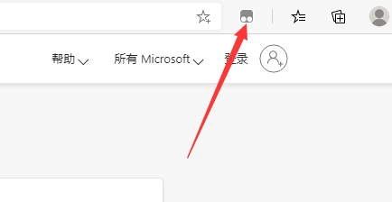

### 1、访问下面的链接，然后根据自己的操作系统下载对应版本的Edge浏览器
https://www.microsoft.com/zh-cn/edge
### 2、运行下载的安装程序，等待安装完成后，打开Edge浏览器
### 3、点击Edge右上角的三个点，打开菜单，选择“扩展”，打开扩展管理器
### 4、点击左侧的“获取Microsoft Edge扩展”，打开扩展商店
### 5、在左上角的输入框内输入“TamperMonkey”，然后回车，等待搜索结果出现
### 6、选择出现的第一个名字完全相符的插件（如下图示），点击右侧的“获取”按钮

### 7、在弹出对话框中点击“添加扩展”按钮，等待扩展安装成功
### 8、在地址栏右侧，点击“TamperMonkey”扩展图标，在弹出菜单中选择“添加新脚本”

### 9、删除弹出的“新建用户脚本”下方的编辑区中的所有内容，然后复制下面的代码，粘贴进入，保存即可。
### 10、打开爱奇艺、腾讯视频即可看到广告快速闪过，VIP自动解析了。

~~~ Javascript
// ==UserScript==
// @name         视频广告加速/VIP自动解析
// @namespace    http://www.mdmsoft.cn/
// @version      1.0
// @description  看个教程，腾讯 优酷视频广告贼烦人，竟然有120秒，不干掉它真是对不起自己程序猿的职业!
// @author       @MdmSoft
// @match        https://v.qq.com/*
// @match        https://v.youku.com/*
// @match        https://www.iqiyi.com/*
// @grant        none
// ==/UserScript==

//解析接口API地址
var jiexiApiArray = ["https://jx.du2.cc/?url=",
                     "https://jx.618g.com/?url=",
                     "https://www.8090g.cn/jiexi/?url=",
                     "https://8090.ylybz.cn/jiexi/?url=",
                     "https://jiexi.bm6ig.cn/?url="]
//随机一个解析接口
//var jiexiApiUrl = jiexiApiArray[Math.round(Math.random()*jiexiApiArray.length,0)];
//使用固定的解析接口（这个比较稳定）
var jiexiApiUrl = "https://z1.m1907.cn/?jx=";
//当前页面href
var nowLocationHref = location.href;
//注入的视频播放器对象
var playerInject;
//注入播放器
function injectPlayer(divId) {
    playerInject = document.getElementById('playerInject');
    //如果没有注入过
    if (!playerInject) {
        //取得原有的播放器框架
        var player = document.getElementById(divId);
        if (player) {
            //如果获取成功
            player.innerHTML = '';
            //设置透明度
            player.style.opacity = 0.00;
            //取得原播放器框架大小
            var rectPlayer = player.getBoundingClientRect();
            //创建DIV，注入并覆盖
            playerInject = document.createElement('div');
            document.body.appendChild(playerInject);
            playerInject.outerHTML = '
<iframe src="' + jiexiApiUrl + window.location.href + '" style="width:100%;height:100%;z-index:999;border-width:0px;overflow-x:hidden;overflow-y:hidden;"></iframe>
';
        }
    }
}
//更改注入的播放器大小
function resizePlayer(divId) {
    //取得原播放器DIV
    var player = document.getElementById(divId);
    playerInject = document.getElementById('playerInject');
    if(player && playerInject){
        //设置注入的播放器大小
        var playRect = player.getBoundingClientRect();
        playerInject.style.left = playRect.x + 'px';
        playerInject.style.top = (playRect.y + document.documentElement.scrollTop) + 'px';
        playerInject.style.width = playRect.width + 'px';
        playerInject.style.height = playRect.height + 'px';
    }
}
//腾讯视频注入
function injectTencent(divClassName) {
    var qqTips = document.getElementsByClassName(divClassName);
    if(qqTips && qqTips.length>0){
         for (var i = 0; i < qqTips.length; i++) {
             if (qqTips[i].style.display == '' && (qqTips[i].innerText.indexOf('开通VIP会员') != -1 || qqTips[i].innerText.indexOf('开通会员') != -1)) {
                 injectPlayer('tenvideo_player');
                 qqTips[i].style.display = 'none';
                 break;
             };
         }
    }
}
setInterval(function() {
    //如果浏览器href变更，则刷新页面
    if (nowLocationHref != location.href) {
        nowLocationHref = location.href;
        console.log('href changed to ' + nowLocationHref);
        if (playerInject) {
            console.log('injected, reload!');
            location.reload();
        }
    }
    var i,adTimes;
    if (window.location.href.indexOf('www.iqiyi.com') != -1) {
        //爱奇艺广告加速通过
        var o = document.getElementsByTagName('video');
        for (i = 0; i < o.length; i++) {
            if (o[i].src != '') {
                //爱奇艺广告倒计时DIV classname
                adTimes = document.getElementsByClassName('cupid-public-time');
                if (adTimes && adTimes.length>0 && adTimes[0].style.display == "") {
                    o[i].playbackRate = 16.0;
                }
                else{
                    o[i].playbackRate = 1.0;
                }
            }
        }
        //拿到爱奇艺播放页右侧的VIP提示
        var vipSides = document.getElementsByClassName('qy-player-side-vip');
        //拿到爱奇艺播放页进度条上方的VIP提示
        var iqyTips = document.getElementsByClassName('iqp-tip-stream');
        //拿到爱奇艺VIP的黑色遮罩（VIP视频直接不让试看的）
        var vipPops = document.getElementsByClassName('qy-player-vippay-popup');
        if(vipSides && vipSides.length>0 || iqyTips && iqyTips.length>0 || vipPops && vipPops.length>0){
            //标志位，标志两个VIP状态
            var isVipSideShown=false, isVipTipsShown=false, isVipPopShow=false;
            for (i = 0; i < vipSides.length; i++) {
                if (vipSides[i].style.display == '' && vipSides[i].innerText.indexOf('开通VIP会员') != -1) {
                    isVipSideShown = true;
                    break;
                }
            }
            //如果播放进度条上方有VIP提示
            for (i = 0; i < iqyTips.length; i++) {
                if (iqyTips[i].style.display == '' && iqyTips[i].getAttribute('data-player-hook').toLocaleLowerCase() == 'videotips') {
                    isVipTipsShown = true;
                    break;
                }
            }
            //如果直接不让试看的
            for (i = 0; i < vipPops.length; i++) {
                if ((vipPops[i].style.display == '' && vipPops[i].innerText.indexOf('试看已结束') != -1 || vipPops[i].innerText.indexOf('请先开通会员') != -1)) {
                    isVipPopShow = true;
                    //VIP提示的黑色屏蔽窗口，隐藏掉
                    vipPops[i].style.display = 'none';
                    break;
                }
            }
            //如果两个VIP提示都出现了，则表示这个视频是VIP，需要注入
            if(isVipPopShow || isVipSideShown && isVipTipsShown){
                injectPlayer('flashbox');
            }
        }
        //右下角VIP登录提示
        var qyScrolls=document.getElementsByClassName('qy-scroll-anchor');
        if(qyScrolls && qyScrolls.length>0){
            qyScrolls[0].style.display = 'none';
        }
        //注入后，跟随外部DIV变大或变小
        resizePlayer('flashbox');
    }
    else if (window.location.href.indexOf('v.qq.com') != -1) {
        //腾讯视频广告加速通过
        var videos = document.getElementsByTagName('video');
        for (i = 0; i < videos.length; i++) {
            if (videos[i].src != '') {
                //腾讯视频广告倒计时DIV classname
                adTimes = document.getElementsByClassName('txp_ad_inner');
                if (adTimes && adTimes.length>0 && adTimes[0].parentNode.className.indexOf('txp_none') != -1) {
                    //如果倒计时DIV已经没有了，则恢复视频播放速度
                    videos[i].playbackRate = 1.0;
                }
                else{
                    if(videos[i].src.indexOf('blob:https://v') == -1){
                        //如果倒计时DIV存在，且当前播放的不是视频，则直接删掉播放的链接
                        videos[i].src = '';
                    }
                    else{
                        //如果倒计时DIV存在，且当前播放是视频，则加速，直到视频广告DIV消失
                        videos[i].playbackRate = 16;
                    }
                }
            }
        }
        //根据不同情况，注入不同的DIV
        injectTencent("mod_vip_popup");
        injectTencent("txp_alert_info");
        //VIP视频，会有一个弹出框，隐藏它
        var vippops = document.getElementsByClassName('mod_vip_popup');
        if (vippops) {
            for (i = 0; i < vippops.length; i++) {
                vippops[i].style.display = 'none';
            }
        }
        //VIP试看结束后，有个黑色的遮罩层，使用这几句隐藏它
        var mask_layer = document.getElementById('mask_layer');
        if(mask_layer){
            mask_layer.style.display = 'none';
        }
        //重新设置注入的播放器大小
        resizePlayer('tenvideo_player');
    }
}, 200);
~~~
